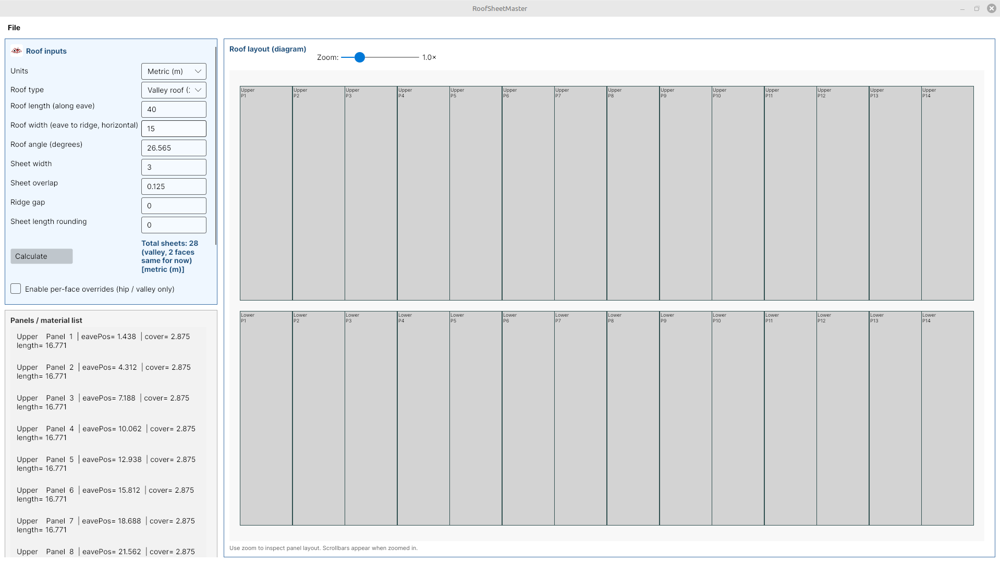

<p align="center">
  
</p>


# RoofSheetMaster

**RoofSheetMaster** is a cross‑platform C#/Avalonia desktop application
for calculating roofing sheet layouts, cut lists, flashings, and visual
diagrams for multiple roof types.

It provides a fast workflow for roofers, designers, metal shop workers,
and construction estimators---automating panel calculations that are
traditionally manual.

------------------------------------------------------------------------

## Features

-   ✔️ Supports Single, Gable, Hip, and Valley roofs\
-   ✔️ Metric and Imperial units\
-   ✔️ Automatic panel width distribution and sheet length calculation\
-   ✔️ Sheet length rounding options\
-   ✔️ Per‑face overrides for complex roofs\
-   ✔️ Generated cut-list (HTML)\
-   ✔️ CSV export for:
    -   Sheet summary\
    -   Full panel list\
    -   Flashings list\
-   ✔️ Roof layout diagram with zoom controls\
-   ✔️ Export roof layout as PNG\
-   ✔️ Save and load project files (`.rsmproj`)


------------------------------------------------------------------------

## Installation & Running

### Prerequisites

-   .NET 8 SDK\
-   Git\
-   Linux, Windows, or macOS

### Clone and build

``` bash
git clone https://github.com/damir-bubanovic/RoofSheetMaster.git
cd RoofSheetMaster/RoofSheetMaster.Desktop
dotnet build
dotnet run
```

The app will start in a desktop window.

------------------------------------------------------------------------

## Project Structure

    RoofSheetMaster/
      Assets/                    → App logo, screenshot
      RoofSheetMaster.Core/      → All calculation logic (panels, flashings, math)
      RoofSheetMaster.Desktop/   → Avalonia UI
          MainWindow.axaml       → UI layout
          MainWindow.axaml.cs    → UI logic
          Execute.cs             → Calculation execution
          Export.*.cs            → Export functionality
          ProjectPersistence.cs  → Save/load .rsmproj

------------------------------------------------------------------------

## How It Works

### 1. Input Parameters

Enter roof geometry, sheet width, overlap, angle, and rounding
preferences.

### 2. Calculation Engine

The **Core** project computes:

-   Effective panel widths\
-   Sheet lengths (with slope + rounding)\
-   Eave position offsets\
-   Grouping by roof face\
-   Flashing lengths and counts

### 3. Visualization

Avalonia renders a diagram showing each sheet scaled horizontally and
vertically.

### 4. Export

You can export:

-   Sheet summary (CSV)\
-   Panel list (CSV)\
-   Flashings (CSV)\
-   Cut list (HTML)\
-   Layout image (PNG)

### 5. Project Files

You can save all inputs and results into a `.rsmproj` JSON file and
reopen it later.

------------------------------------------------------------------------

## Example Outputs

### Sheet Summary CSV

    SheetLength,Count
    2.500,4
    3.125,6
    3.750,2

### Cut List HTML

Produced automatically with per‑panel details.

### Layout PNG

Generated exactly as shown in the UI diagram.

------------------------------------------------------------------------

## Roadmap

-   Additional roof shapes\
-   Multi‑material support\
-   Printing layout directly to PDF\
-   Custom flashing profiles\
-   Color‑coded diagram

------------------------------------------------------------------------

## Author

**Damir Bubanović**

-   Website: https://damirbubanovic.com\
-   YouTube: https://www.youtube.com/@damirbubanovic6608\
-   GitHub: https://github.com/damir-bubanovic\
-   StackOverflow:
    https://stackoverflow.com/users/11778242/damir-bubanovic\
-   Email: damir.bubanovic@yahoo.com

------------------------------------------------------------------------

## License

MIT License --- free for personal and commercial use.

------------------------------------------------------------------------

## Acknowledgments

-   Built with **.NET 8**, **Avalonia UI**, **C#**\
-   Design and refinement assisted by **ChatGPT**
